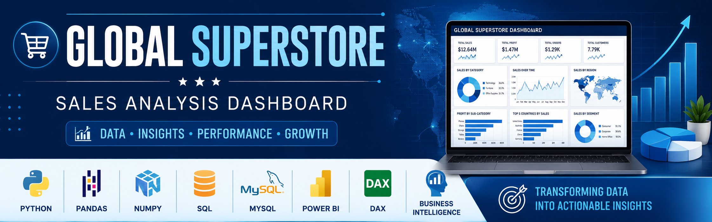
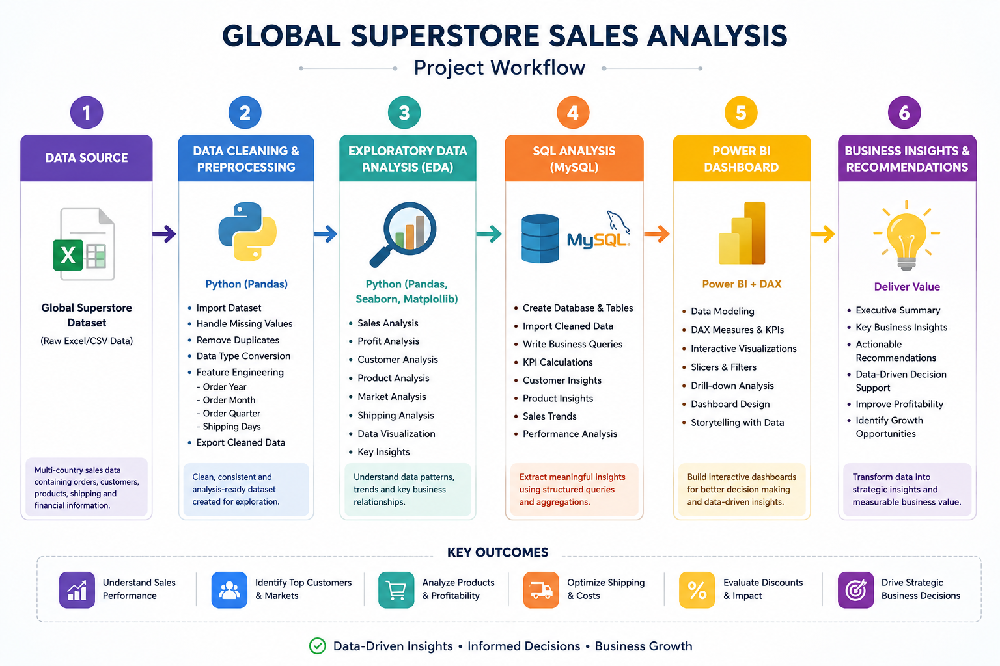
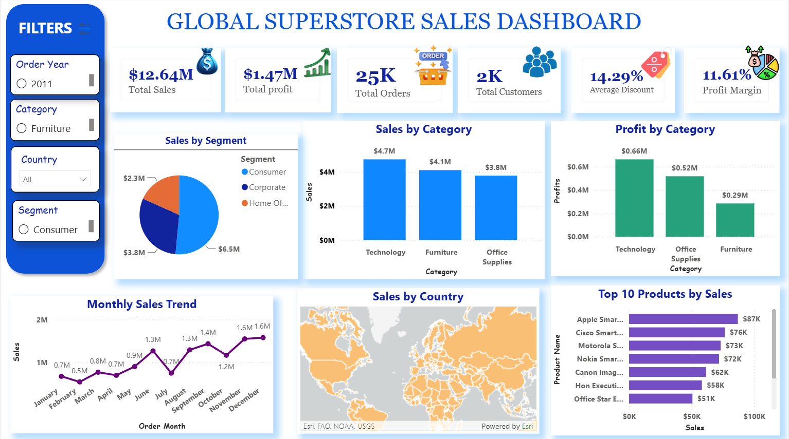
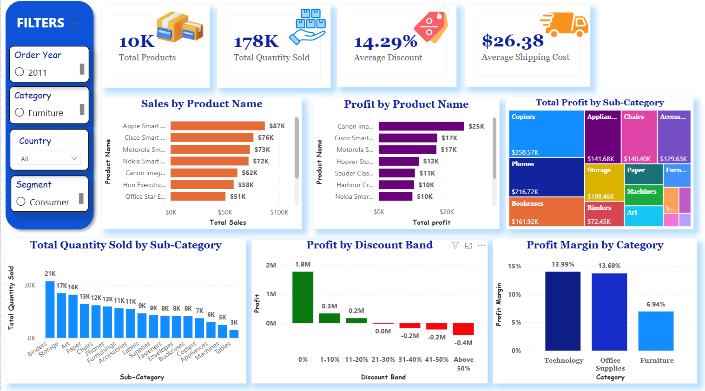
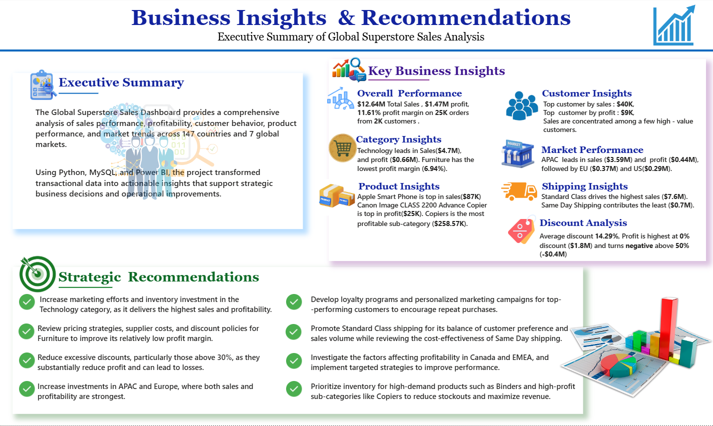

# 📊 Global Superstore Sales Analysis

<p align="center">
  
</p>


An end-to-end **Data Analytics** project developed by **Sobhan Kundu** using **Python, MySQL, and Power BI** to analyze the Global Superstore dataset and generate actionable business insights through data cleaning, SQL analysis, and interactive dashboards.

## Table of Contents

- [Project Overview](#project-overview)
- [Project Objectives](#project-objectives)
- [Business Questions Answered](#business-questions-answered)
- [Project Workflow](#project-workflow)
- [Repository Structure](#repository-structure)
- [Dataset Information](#dataset-information)
- [Tools & Technologies](#tools--technologies)
- [Skills Demonstrated](#skills-demonstrated)
- [Python Workflow](#python-workflow)
- [SQL Workflow](#sql-workflow)
- [Power BI Dashboard](#power-bi-dashboard)
- [Key Business Insights](#key-business-insights)
- [Business Recommendations](#business-recommendations)
- [How to Run This Project](#how-to-run-this-project)
- [Future Improvements](#future-improvements)
- [Learning Outcomes](#learning-outcomes)
- [Author](#author)
- [License](#license)


---

## 📖 Project Overview

The Global Superstore dataset contains retail sales transactions from multiple countries and markets. The objective of this project is to transform raw transactional data into meaningful business insights using industry-standard data analytics tools and techniques.

This project follows a complete analytics workflow:

-  **Python** – Data Cleaning & Exploratory Data Analysis (EDA)
-  **MySQL** – Business Analysis using SQL queries
-  **Power BI** – Interactive dashboard creation
-  **Business Insights & Recommendations** – Supporting data-driven decision-making

Through this project, I applied data analysis, SQL, data visualization, and business intelligence concepts to identify sales trends, customer behavior, product performance, and profitability across different markets.

## 🎯 Project Objectives

The primary objective of this project is to analyze the Global Superstore dataset and uncover meaningful business insights that can support data-driven decision-making.

The project aims to:

- Analyze overall sales and profit performance.
- Identify top-performing and low-performing products.
- Evaluate sales trends across years, quarters, and months.
- Understand customer purchasing behavior across different market segments.
- Compare sales and profitability across countries, regions, and markets.
- Analyze discount patterns and their impact on profitability.
- Monitor shipping performance and operational efficiency.
- Design an interactive Power BI dashboard to present key business metrics and insights.


## ❓ Business Questions Answered

This analysis addresses several important business questions, including:

1. What are the total sales, profit, and number of orders?
2. Which products generate the highest sales and profit?
3. Which products are the least profitable?
4. How do sales and profit vary over time?
5. Which markets and countries contribute the most revenue?
6. Which customer segments generate the highest profit?
7. How do discounts affect business profitability?
8. Which categories and sub-categories perform the best?
9. What is the average order value and profit margin?
10. What business recommendations can improve overall performance?

## 🔄 Project Workflow

This project follows a structured end-to-end data analytics workflow, transforming raw data into meaningful business insights through multiple stages of analysis and visualization.

<p align="center">
  
</p>

### Workflow Stages

####  1. Data Collection
- Imported the Global Superstore dataset.
- Reviewed the dataset structure and attributes.
- Identified data types and key business fields.

####  2. Data Cleaning & Preprocessing (Python)
- Handled missing values.
- Checked and removed duplicate records.
- Converted data types.
- Created new analytical features.
- Prepared the cleaned dataset for SQL and Power BI.
- Converted date columns
- Created derived columns (Order Year, Month, Quarter, Shipping Days)

####  3. Exploratory Data Analysis (Python)
- Performed statistical analysis.
- Explored sales, profit, discounts, and shipping trends.
- Identified outliers and data distribution.
- Generated visualizations to understand business patterns.

####  4. Business Analysis (MySQL)
- Imported the cleaned dataset into MySQL.
- Calculated key business KPIs.
- Analyzed product performance.
- Evaluated customer and market performance.
- Measured profitability and discount impact.
- Answered business questions using SQL queries.

####  5. Dashboard Development (Power BI)
- Designed an interactive dashboard.
- Built KPI cards and business visuals.
- Created slicers for dynamic filtering.
- Developed multiple dashboard pages for executive reporting.

####  6. Business Insights & Recommendations
- Identified top-performing products and markets.
- Highlighted low-performing categories.
- Evaluated customer purchasing behavior.
- Recommended data-driven strategies to improve sales and profitability.

## 📁 Repository Structure

```text
Global-Superstore-Sales-Analysis/
│
├── Dashboard/
│   └── Global_Superstore_Dashboard.pbix
│
├── Dataset/
|   ├── Global Superstore.xls
│   └── Global_Superstore_Cleaned.csv
│
├── Python/
│   ├── 01_Data_Cleaning.ipynb
│   ├── 02_Exploratory_Data_Analysis.ipynb
│   └── requirements.txt
│
├── SQL/
│   ├── Global_Superstore_SQL_Analysis.sql
│   ├── README.md
│   └── SQL_Output_Screenshots/
│
├── Images/
│   ├── Dashboard_Page_1.png
│   ├── Dashboard_Page_2.png
│   ├── Dashboard_Page_3.png
│   └── Dashboard_Page_4.png
│
├── Docs/
│   └── Project_Workflow.png
│
├── README.md
├── LICENSE
└── .gitignore
```
###  Folder Description

| Folder/File       | Description |
|-------------------|-------------|
| **Dashboard/**    | Contains the Power BI dashboard (.pbix) file. |
| **Dataset/**      | Stores the original and cleaned Global Superstore dataset used for analysis. |
| **Python/**       | Includes Jupyter notebooks for data cleaning and exploratory data analysis (EDA). |
| **SQL/**          | Contains SQL scripts, documentation, and SQL output screenshots. |
| **Images/**       | Stores dashboard screenshots used in this README. |
| **Docs/**         | Contains project documentation, workflow diagrams, and supporting files. |
| **README.md**     | Main documentation for the project. |
| **LICENSE**       | Open-source license for the repository. |
| **.gitignore**    | Specifies files and folders to be ignored by Git. |

## 📁 Dataset Information

| Attribute | Details |
|-----------|---------|
| **Dataset Name** | Global Superstore |
| **Source** | Kaggle |
| **Domain** | Retail Sales |
| **Rows** | 51,290 |
| **Columns** | 28 |
| **File Format** | CSV |

###  Dataset Description

The Global Superstore dataset contains transactional retail sales data collected from multiple countries and markets. It includes information about customers, products, orders, shipping, sales, profit, discounts, and geographical locations.

The dataset is well suited for business intelligence and data analytics projects because it enables the analysis of sales performance, customer behavior, profitability, market trends, and operational efficiency.


## 🛠️ Tools & Technologies

The following tools and technologies were used throughout this project:

| Tool / Technology | Purpose |
|-------------------|---------|
| **Python** | Data cleaning and preprocessing |
| **Pandas** | Data manipulation and transformation |
| **NumPy** | Numerical computations |
| **Matplotlib** | Data visualization during EDA |
| **Jupyter Notebook** | Data cleaning and exploratory analysis |
| **MySQL** | Business analysis using SQL |
| **SQL** | Data querying and KPI calculations |
| **Power BI** | Interactive dashboard development |
| **DAX** | KPI measures and calculated metrics |
| **Git** | Version control |
| **GitHub** | Project hosting and portfolio |


## 💼 Skills Demonstrated

This project demonstrates proficiency in:

- Data Cleaning
- Exploratory Data Analysis (EDA)
- SQL Query Writing
- Business Analysis
- KPI Development
- Data Visualization
- Dashboard Design
- Business Intelligence
- Problem Solving
- Data Storytelling

## 🐍 Python Workflow

Python was used for data cleaning, preprocessing, feature engineering, and exploratory data analysis (EDA) to prepare the dataset for SQL analysis and Power BI dashboard development.

### 🗄️ Data Cleaning & Preprocessing

The following preprocessing steps were performed:

- Imported the Global Superstore dataset into Jupyter Notebook.
- Inspected the dataset structure and data types.
- Checked for missing values.
- Verified duplicate records.
- Converted date columns into proper datetime format.
- Created additional analytical columns:
  - Order Year
  - Order Month
  - Order Quarter
  - Shipping Days
- Exported the cleaned dataset for SQL analysis and Power BI.

---

### Exploratory Data Analysis (EDA)

Exploratory Data Analysis was performed to understand the characteristics of the dataset before building dashboards.

The analysis included:

- Dataset overview
- Summary statistics
- Sales distribution
- Profit distribution
- Category-wise sales analysis
- Sub-category performance
- Country-wise sales analysis
- Top-performing products
- Customer analysis
- Shipping analysis
- Correlation analysis

---

###  Key Python Visualizations

The following visualizations were created during the EDA phase:

- Top 10 Countries by Profit
- Sales by Category
- Profit by Category
- Sales Distribution
- Profit Distribution
- Correlation Heatmap
- Monthly Sales Trend
- Top 10 Products by Sales


###  Python Files

```text
Python/
│
├── 01_Data_Cleaning.ipynb
└── 02_Exploratory_Data_Analysis.ipynb
```

###  Outcome

The cleaned and transformed dataset served as the foundation for:

- SQL-based business analysis
- KPI calculations
- Power BI dashboard development
- Business insights and recommendations

## 🗄️ SQL Workflow

MySQL was used to perform business analysis on the cleaned Global Superstore dataset. SQL queries were written to extract meaningful insights, calculate key performance indicators (KPIs), and answer important business questions.

###  Database Setup

The SQL workflow included:

- Creating the project database.
- Creating the `orders` table.
- Importing the cleaned CSV dataset.
- Converting date fields into SQL `DATE` format.
- Validating imported records.


###  Business Analysis Performed

The SQL analysis was divided into multiple business-focused sections:

####  KPI Analysis
- Total Sales
- Total Profit
- Total Orders

####  Product Analysis
- Top Selling Product
- Most Profitable Product
- Least Profitable Product
- Top 10 Products by Profit

####  Sales Analysis
- Yearly Sales
- Monthly Sales
- Quarterly Sales
- Highest Sales Month
- Sales by Category
- Top 5 Cities by Sales

####  Profit Analysis
- Yearly Profit
- Highest Profit Year
- Market with Highest Profit
- Profit by Sub-Category
- Profit Margin by Category

####  Customer & Market Analysis
- Top 10 Customers by Sales
- Top 10 Customers by Profit
- Sales by Customer Segment
- Top 10 Countries by Profit
- Countries with Sales above 500K
- Orders by Market

####  Shipping & Discount Analysis
- Average Shipping Cost by Ship Mode
- Average Discount by Category

####  Business Classification
Using SQL `CASE` statements to classify:

- Sales Performance
- Profit Status
- Discount Levels

####  Business Summary
- Order Classification Summary
- Profit Status Summary
- Average Order Value (AOV)


###  SQL Files

```text
SQL/
│
├── Global_Superstore_SQL_Analysis.sql
├── README.md
└── SQL_Output_Screenshots/
```

###  Outcome

The SQL analysis transformed raw transactional data into meaningful business insights, which were later visualized in Power BI dashboards. The queries helped identify sales trends, customer behavior, product performance, profitability, and operational patterns to support data-driven decision-making.

### 📊 Power BI Dashboard

The final stage of this project involved developing an interactive Power BI dashboard to transform the SQL analysis and Python insights into visually compelling and actionable business intelligence.

The dashboard enables users to monitor key business metrics, analyze sales performance, evaluate profitability, understand customer behavior, and identify growth opportunities through interactive visualizations.

### Dashboard Features

- Interactive KPI Cards
- Dynamic Filters (Slicers)
- Drill-down Analysis
- Geographic Sales Visualization
- Product Performance Analysis
- Customer & Market Insights
- Profitability Analysis
- Business Summary Dashboard

---

##  Dashboard Pages

###  Page 1 – Executive Dashboard

**Purpose**

Provides a high-level overview of overall business performance using key performance indicators and executive-level visualizations.

**Highlights**

- Total Sales
- Total Profit
- Total Orders
- Total Customers
- Sales by Region
- Sales by Market
- Top 10 Products by Sales
- Geographic Sales Distribution

<p align="center">
  
</p>

---

###  Page 2 – Customer & Market Insights

**Purpose**

Analyzes customer purchasing behavior and market performance to identify high-value customers and profitable markets.

**Highlights**

- Sales by Customer Segment
- Profit by Market
- Sales by Region
- Top Countries by Sales
- Customer Distribution
- Market-wise Performance

<p align="center">
  
</p>

---

###  Page 3 – Product Performance

**Purpose**

Evaluates product performance, profitability, discounts, and inventory-related metrics.

**Highlights**

- Top Products by Sales
- Top Products by Profit
- Profit by Sub-Category
- Quantity Sold by Sub-Category
- Profit Margin by Category
- Discount Analysis

<p align="center">
  
</p>

---

### Page 4 – Business Insights & Recommendations

**Purpose**

Summarizes the overall analysis by highlighting important findings and providing actionable business recommendations.

**Highlights**

- Key Business Insights
- Business Recommendations
- Executive Summary
- Strategic Decision Support

<p align="center">
  
</p>


## 💡 Key Performance Indicators (KPIs)

The dashboard tracks the following KPIs:

- Total Sales
- Total Profit
- Total Orders
- Total Customers
- Total Products
- Average Order Value (AOV)
- Average Discount
- Average Shipping Cost
- Profit Margin

##  Interactive Features

The Power BI dashboard includes interactive features that allow users to explore the data dynamically.

- Region Filter
- Market Filter
- Category Filter
- Segment Filter
- Year Filter
- Drill-through Analysis
- Cross-filtering Between Visuals


##  Dashboard Outcome

The dashboard provides an executive-level view of business performance while allowing detailed exploration of sales trends, profitability, customer behavior, and market performance. It enables stakeholders to make informed, data-driven business decisions through interactive reporting.


##  Key Business Insights

The analysis of the Global Superstore dataset revealed several important business insights that can help improve operational efficiency and profitability.

###  Sales Performance

- The business generated strong sales across multiple global markets, indicating a diverse customer base.
- Sales performance varied across different years, highlighting seasonal and yearly business trends.
- A small number of products contributed a significant portion of total sales, indicating high-performing product lines.

###  Profitability Analysis

- High sales do not always result in high profits due to discounts and varying profit margins.
- Some product categories generated higher profit margins despite lower overall sales.
- Certain products consistently underperformed and contributed minimal or negative profit.

###  Market Performance

- A few countries and markets accounted for the majority of total revenue and profit.
- Regional performance varied significantly, suggesting opportunities for market-specific strategies.

###  Customer Insights

- A relatively small group of customers contributed a large share of total sales.
- Customer segments showed different purchasing patterns and profitability levels.

###  Product Analysis

- Product performance differed considerably across categories and sub-categories.
- Identifying high-performing products can support inventory planning and marketing strategies.

### Shipping & Discount Analysis

- Shipping costs varied depending on the selected shipping mode.
- Higher discounts were not always associated with higher profitability, emphasizing the importance of optimized pricing strategies.

---

## 📌 Business Recommendations

Based on the analysis, the following recommendations can help improve business performance:

- Focus marketing efforts on high-performing products and profitable customer segments.
- Review pricing and discount strategies for low-margin products.
- Expand operations and promotional campaigns in high-performing markets.
- Reassess underperforming products and consider inventory optimization.
- Monitor shipping costs to improve operational efficiency.
- Develop customer retention strategies for high-value customers.
- Use historical sales trends for demand forecasting and inventory planning.
- Continuously monitor key performance indicators (KPIs) using interactive dashboards to support data-driven decision-making.

---


## 🚀 How to Run This Project

Follow these steps to explore the project:

### 1. Clone the Repository

```bash
git clone https://github.com/your-username/Global-Superstore-Sales-Analysis.git
```

### 2. Open the Python Notebooks

Navigate to the `Python/` folder and open the Jupyter notebooks to review the data cleaning and exploratory data analysis (EDA) process.

### 3. Import the Dataset into MySQL

- Create a new database.
- Run the `Global_Superstore_SQL_Analysis.sql` script.
- Update the CSV file path in the `LOAD DATA LOCAL INFILE` statement before importing the dataset.

### 4. Open the Power BI Dashboard

Open the `Global_Superstore_Dashboard.pbix` file using **Microsoft Power BI Desktop** to explore the interactive dashboard.

---

## 🔮 Future Improvements

Potential enhancements for this project include:

- Implement sales forecasting using Machine Learning.
- Perform customer segmentation using clustering techniques.
- Build an inventory optimization model.
- Develop a real-time dashboard using live data.
- Integrate additional business KPIs.
- Publish the dashboard using the Power BI Service.

---

## 🎓 Learning Outcomes

This project helped strengthen practical skills in:

- Python Programming
- Data Cleaning & Preprocessing
- Exploratory Data Analysis (EDA)
- SQL Query Writing
- Business Analysis
- Power BI Dashboard Development
- DAX Calculations
- Data Visualization
- Business Intelligence
- Data Storytelling
- Git & GitHub

---

## 👨‍💻 Author

**Sobhan Kundu**

Bachelor of Technology (Computer Science & Engineering)

Sister Nivedita University, Kolkata

### Skills

- Python
- SQL
- MySQL
- Power BI
- Data Analytics
- Business Intelligence
- Exploratory Data Analysis (EDA)
- Data Visualization

---

##  If you found this project useful

If you found this project helpful or interesting, consider giving it a ⭐ on GitHub. Your support is greatly appreciated!

---

## 📄 License

This project is licensed under the **MIT License**. See the `LICENSE` file for more details.